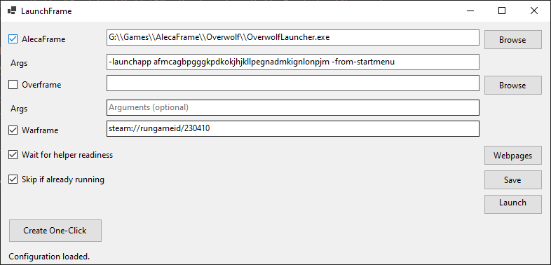

# LaunchFrame

  

LaunchFrame is a Windows launcher that starts Warframe together with helper tools (AlecaFrame, Overframe currently) and opens your reference links in one click (such as wiki.warframe or warframe.market).

## What it does
- Starts helpers first, waits for them to be ready, then launches Warframe (default Steam URI `steam://rungameid/230410`).
- Lets you enable/disable helpers and URLs, edit paths/arguments, and save settings.
- Saves config at `%AppData%\LaunchFrame\config.json` and auto-discovers common install paths when missing.
- Can run headless with `--oneclick` for shortcut/Task Scheduler use.

## Requirements
- Windows 10/11

## Setup
1. Download the latest release zip from GitHub Releases.
2. Extract it anywhere (e.g., Desktop or a tools folder).
3. Run `LaunchFrame.exe`.

## Using LaunchFrame
- Set paths/arguments for AlecaFrame and Overframe, toggle them on/off.
- Set the Warframe URI if you use a non-default launcher.
- Optional: check "Wait for helper readiness" or "Skip if already running".
- Click "Launch Session" to run the sequence.
- Use "Create One-Click" to generate a shortcut that runs `--oneclick` without the UI.

## Notes
- No game injection or modification; LaunchFrame only starts processes and opens URLs.
- Config is created on first save/launch; edit via the UI or by editing the JSON if needed.

## Support LaunchFrame

Enjoying the utility of LaunchFrame? Consider supporting the developer: 

**Buy / Play My Games!** 

    
    
    
    

Donations Accepted

